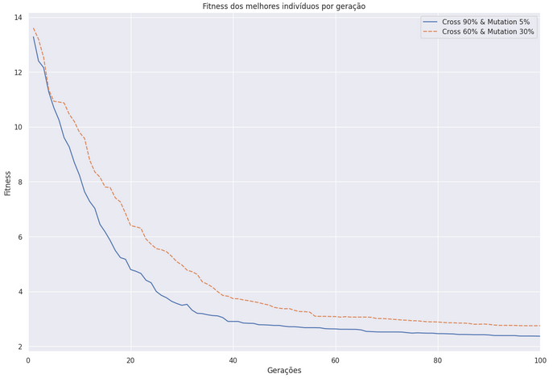

# Programação genética: Regressão simbólica


### Documentação trabalho prático 1 de Computação Natural, DCC, UFMG, 2023-1.
Lucas Starling de Paula Salles, 2016006697.


---


### Seções:
1. Introdução
2. Implementação
3. Experimentos
4. Conclusão
---


## Introdução
>O principal objetivo deste trabalho  é desenvolver conceitos chave para a construção de soluções para problemas usando Programação Genética (GP), envolvendo o entendimento e a implementação dos componentes básicos de um arcabouço de GP, bem como a an ́alise de sen-
possibilidade dos seus parâmetros (como eles afetam o resultado final, a natureza da convergência, etc) e procedimentos para avaliação das soluções alcançadas.
Uma dos problemas mais populares que podem ser resolvidos com técnicas de programação genética ́ é a regressão simbólica. Conforme visto em sala de aula, dado um conjunto de amostras provenientes de uma função desconhecida, representadas por uma dupla $⟨X, Y⟩$ onde $X \in R_{mn}, Y \in R_m$, o objetivo ́e encontrar a expressão simbólica de $f$ que melhor se ajusta às amostras fornecidas.


Programação Genética é um conjunto de técnicas computacionais evolucionárias que permitem treinar um algoritmo para resolver um problema baseando-se apenas em exemplos de casos de entrada e saída conhecidos para aquele problema.


Essas técnicas se adequam particularmente bem para problemas de regressão simbólica, uma vez que casos exemplos para esses problemas consistem simplesmente de um conjunto valores de entrada e o valor esperado de saída para uma função desconhecida. Além disso a representação de soluções candidatas é razoavelmente simples para esses problemas, geralmente consistindo de uma equação algébrica onde a posição dos operadores, variáveis e constantes são definidos pelo genoma do indivíduo.


Para esse trabalho foi implementado um algoritmo de programação genética para solução de regressões simbólicas onde indivíduos foram representados por árvores compostas por nós terminais, que representam as variáveis e constantes do problema, e nós não terminais que por sua vez representam os operadores disponíveis.


O algoritmo implementado consiste essencialmente de três etapas, primeiro é gerado um conjunto de soluçṍes candidatas aleatórias. Em seguida os indivíduos da população são selecionados para sofrerem alterações, possibilitando que as soluções se aproximem da função objetivo. Por fim, indivíduos atualmente presentes na população são selecionados para integrar a próxima geração da população ou não. As etapas 2 e 3 do algoritmo se repetem para um número definido pelo usuário de gerações, conforme as gerações progridem os indivíduos podem ser independentemente alterados, através de mutações. Além disso, também foi implementado o operador de crossover que permite que hajam trocas de características entre indivíduos da população. Conforme os indivíduos são alterados, as equações que eles representam se aproximam e se afastam da função objetivo. A proximidade de cada indivíduo para a função objetivo é usada para determinar os componentes da população na próxima geração.


Na próxima seção deste documento a implementação deste algoritmo será discutida.


---
## Implementação


### Seções:
1. Introdução
2. **Implementação**:
   - Representação do indivíduo
   - Inicialização da população
   - Operadores genéticos
   - Interface & parâmetros
3. Experimentos
4. Conclusão


## Representação do indivíduo
### Gene:
Conforme abordado anteriormente o indivíduo nesse projeto é uma árvore, cada nó contendo um componente terminal ou não terminal. Os nós dessa árvore foram implementados pela classe `Gene`, localizada em `modules/gene.py`. Um objeto da classe `Gene` conta com os atributos:
- `handle` (*string*): O componente representado por um nó é armazenado nesse atributo.
- `depth` (*int*): Armazena a profundidade de um dado nó, utilizado para métodos impressão do indivíduo para debug assim como para limitar o tamanho máximo dos indivíduos da população.
- `children` (*List[Gene]*): Lista de apontadores para os filhos do nó.


Além desses atributos a classe também conta com atributos de controle usados nos diversos métodos implementados para a classe. Dentre esses métodos os mais importantes para a execução do processo de evolução são:
- `*variable*`,`*coefficient*`,`*operator*` (`Gene`): métodos de construção de um objeto da classe `Gene`, criando um nó configurado para representar os respectivos tipos de nós.
- `*eval*` (`float`): Função que recebe os valores para cada umas das variáveis da função objetivo e recursivamente avalia a expressão algébrica determinada por um nó e seus filhos.


```python
class Gene:
   def __init__(self):
       self.depth = 0
       self.handle: str = ''
       self.children: List[Gene] = []
       self.__unset_type = True
       self.__terminal: bool = False
       self.__var: int = -1
       self.__operation: Callable[[List[float]], float] = self.__do_const
       self.__values: List[float] = []


   def eval(self, vars: List[float]) -> float:
       if self.__unset_type:
           raise Exception('ERR002: Tring to resolve unset node')
      
       if not self.__terminal:
           for child in self.children:
               step = child.eval(vars)
               self.__values.append(step)


           return self.__operation(self.__values)
       else:
           return self.__operation(vars)


```


A capacidade de um indivíduo aproximar o uma função desconhecida depende de quais operadores, coeficientes e variáveis os genes podem representar. Para esse projeto foram escolhidos, de acordo com o conteúdo visto em sala, os operadores de multiplicação, divisão, subtração e soma. Com relação à variáveis e coeficientes a interface da classe `Gene` permite a representação de qualquer variável ou coeficiente. Para os experimentos foram usados as variáveis necessárias para cada base de dados e os coeficientes `[1, 2]`.


### Chromosome
O individuo como um todo foi implementado pela classe `Chromosome`, sendo o seu genótipo armazenado em um objeto `Gene` chamado `root` que é a raiz da arvore de genes do indivíduo. os demais atributos são:
- `*terminals*`, `*non_terminals*` (`List[str]`): Armazena as opções de nós para escolha dos operadores genéticos e da construção inicial dos indivíduos.
- `*max_depth*`, `*depth*` (`int`): Variáveis que armazenam a profundidade e a profundidade máxima permitida do indivíduo.
- `*fit_val*` (`float`): Armazena o valor da fitness do indivíduo para os dados escolhidos.
- `*fenotype*` (`str`): Armazena o fenótipo, um string contendo a expressão algébrica com os literais gerada pelo genótipo do indivíduo.


Essa classe é responsável pela implementação de métodos essenciais para o funcionamento do algoritmo, em particular os operadores genéticos e a construção aleatória dos indivíduos iniciais, contudo devido à importância dessas funções elas serão explicadas nas próximas seções. Além dos métodos analisados em seguida, o método mais importante dessa classe é `*fitness*`, responsável por calcular a métrica RMSE, usada como fitness nesse projeto.


```python
class Chromosome:
   def __init__(self, max_depth: int, methods: List[int], terminals: List[str], non_terminals: List[str]):
       self.terminals: List[str] = terminals
       self.non_terminals: List[str] = non_terminals
       self.max_depth: int = max_depth
       self.depth = -1
       self.root, depth = build(0,randint(1, self.max_depth),methods, terminals, non_terminals)
       self.set_depth(depth)
       self.fenotype: str = '&'
       self.update_fenotype()
       self.fit_val = 0
  
   def fitness(self, data: List[List[float]], inplace: bool = True):


       sum_squared_err = 0
       for vars in data:
           err = self.root.eval(vars[:-1]) - vars[-1]
           squared_err = err**2
           sum_squared_err += squared_err
      
       mean_squared_err = sum_squared_err / len(data)
       rmse = sqrt(mean_squared_err)
      
       if inplace:
           self.fit_val = rmse


       return rmse
```


## Inicialização da população


A população precisa ser iniciada com indivíduos gerados aleatoriamente para isso foi implementado o método `*build*` que implementa ambos os métodos de geração de árvores aleatórias vistos em sala de aula, *Grow* e *Full*. Para operar ele recebe a profundidade máxima da árvore, a profundidade atual do nó que será selecionado uma lista de métodos, podendo ser Full ou Grow, e as opções disponíveis de nós.


Esse método funciona recursivamente escolhendo aleatoriamente um nó por vez. Na primeira passagem pela recursão o método escolhe qual estratégia de construção de árvores será usada, caso mais de um seja passado para o método. O nó escolhido pode ser um terminal ou um não terminal dependendo da profundidade atual da estratégia de construção selecionada.


Dessa forma, em média, metade dos indivíduos é gerado pela estratégia *Full* e metade é gerado pela estratégia *Grow*. Isso garante que a população inicial seja composta por uma variedade de indivíduos, parte deles com o máximo de nós permitido pelo limite de profundidade e parte com tamanhos variados e distribuições.


---


## Operadores genéticos


Foram implementados os operadores genéticos de Crossover e Mutação. Ambos os operadores funcionam inicialmente de forma similar. Uma vez que um indivíduo é selecionado um gerador aleatório escolhe um número entre 0 e 1, se esse número for menor ou igual a probabilidade designada pelo usuário como probabilidade para ocorrência de cada operador genético.


### Crossover
O operador genético é acionado uma vez que dois indivíduos selecionados para a próxima geração são sorteados para o crossover. Então para cada indivíduo é selecionado um ponto aleatório da árvore para que seja feita a troca. Os pais dos nós selecionados então são usados para realizar a troca, trocando os respectivos filhos e um pai para o outro e vice-versa.


Esse procedimento ocasionalmente gera indivíduos com profundidade maior que a permitida, nesse caso o novo indivíduo gerado por crossover é descartado e o indivíduo original que sofreu a operação genética é adicionado à nova população.


### Mutação


Uma vez que um nó é selecionado para mutação um outro sorteio é feito, para decidir qual tipo de mutação será realizada, Redução, Expansão, ou Pontual. Escolhido o tipo de mutação um nó da árvore é selecionado aleatoriamente e sofre a operação genética. Os operadores de mutação foram implementados de forma a não gerar indivíduos com profundidade maior que o limite, portanto depois de sofrerem a mutação os indivíduos são adicionados à nova população.


---


## Interface & parâmetros


### Instalação
Para instalar o programa localmente, execute os comandos a seguir dentro da pasta do repositório.


```
pip uninstall genprog -y
python -m build
pip install -e .
```


### Entrada


Todos os parâmetros necessários para a experimentação com o código são selecionáveis pelo usuário ao chamar o programa.


Para usar:
```
genprog <data-file-path> <number-of-repeats-of-experiment> <number-of-individuals-in-population> <number-of-generations> <probability-of-crossover> <probability-of-mutation> --random_seed <seed-for-random-number-generation> --elitism <number-of-individuals-for-elitism>
```
Exemplo:
```
genprog datasets/concrete/concrete-test.csv 1 tournament 500 500 0.9 0.05 -rs 1 -e 1 > exp/concrete/test2.csv
```
### Saída


Uma vez iniciado o código vai executar o experimento descrito pelos parâmetros `<number-of-repeats-of-experiment> ` vezes, e para cada geração do processo de evolução, é feito uma média de todas as repetições do experimento e são emitidas as seguintes métricas em formato csv:
max,mean,min,cross_improvec,cross_worsenc,unique
- `max`: Fitness do pior indivíduo da geração.
- `mean`: Fitness média geração.
- `min`: Fitness do melhor indivíduo da geração.
- `cross_improvec`: Número de indivíduos gerados por crossover com fitness melhor que a média dos pais.
- `cross_worsenc`: Número de indivíduos gerados por crossover com fitness pior que a média dos pais.
- `unique`: Número de indivíduos com fenótipo único na população.


---


## Experimentos


Os experimentos a seguir todos foram executados 30 vezes, e os dados plotados representam a média de todas as execuções. Todos os experimentos foram executados para as mesmas sementes de geradores aleatórios, sendo que para cada repetição do experimento é feito um incremento na semente aleatória, para que os números gerados não sejam os mesmos da rodada anterior.


### Synth Data | Treino


Para os dados sintéticos o treino foi realizado com a base synth1-train, para determinar o melhor conjunto de parâmetros para serem usados para a avaliação do algoritmo.


Primeiro passo foi a escolha do tamanho da população e do número de gerações ideal para ser utilizado. Para isso foram executados 9 experimentos para averiguar qual combinação de parâmetros era mais adequada:


Analisando esse plot podemos identificar que o número de indivíduos da população afeta o resultado do algoritmo mais que o número de gerações, além disso podemos ver que para efeitos de comparação 100 gerações são suficientes para diferenciarmos a qualidade de experimentos distintos.


O próximo passo foi escolher o melhor método de seleção para os dados sintéticos, para isso foram executados 4 experimentos, com 500 indivíduos, 100 gerações, e os 4 diferentes métodos de seleção implementados: *Aleatório*, *Torneio*, *Roleta* e *lexicase*:


Entre os métodos de seleção podemos observar que roleta e escolha de indivíduos aleatoriamente não convergem, apresentam comportamento errático característico de escolhas aleatórias. A roleta é então descartada como opção de seleção. Entre as opções que restam o torneio converge mais rapidamente e com menos flutuações para os dados sintéticos, portanto esse método de seleção será utilizado.


Em seguida foi comparado o experimento com 500 indivíduos, 100 gerações com e sem elitismo. Para evitar o overfit foi usado apenas um indivíduo para o processo de elitismo.


Observando os resultados vemos que o elitismo claramente melhora os resultados obtidos.


Os últimos parâmetros para analisar são as probabilidades de crossover e mutação, conforme sugerido na proposta do trabalho foram avaliadas as porcentagens 90% para crossover e 5% para mutação e 60% de crossover e 30% para mutação:





A diferença entre esses resultados não são tão gritantes quanto para os demais parâmetros contudo usar 90% e 5% gerou resultados melhores portanto esses serão os valores utilizados para o teste.


### Synth Data | Teste


Na etapa de treino foram definidos os melhores parâmetros para usar nos dados sintéticos:
- População: Quanto mais indivíduos melhor, `500` indivíduos.
- Gerações: Quanto mais gerações mais a fitness pode melhorar, `500` gerações.
- Seleção: entre os métodos implementados, `Torneio` gerou os melhores resultados.
- Elitismo: O elitismo de um indivíduo aprimora os resultados, `1` indivíduo de elitismo.
- Probabilidade de crossover: 90%.
- Probabilidade de mutação: 5%.


Para esses testes o experimento foi executado apenas duas vezes, uma para cada base de teste: `synth1-test` e `synth2-test`:


O código se comportou excepcionalmente bem para a base de testes `synth1`, convergindo para erro 0 dentro de poucas gerações. Já para o teste `synth2` ocorreu pouca melhora durante todas as 500 gerações, é possível que os operadores genéticos implementados não sejam suficientes para gerar convergência nesse caso.


Este gráfico mostra o valor da fitness média por geração. Podemos observar que os valores então na casa de centenas de milhares. Isso se deve em grande parte ao valor default escolhido como 10000 para o retorno de uma divisão por mil, mas significa que não foram todos os indivíduos da população que convergiram para solucionar melhor os problemas. Isso provavelmente se deve a falta de pressão seletiva no momento de serem realizadas operações genéticas.


O gráfico de indivíduos únicos por geração também não converge, demonstra comportamento errático, o que fortalece a hipótese que existe uma falta de pressão seletiva no algoritmo.


## Concrete Data | Treino


Para o treino dos dados concretos foi usada a base de dados `concrete-train`, por conta do tamanho dessa base de dados de treino os experimentos foram realizados em uma ordem diferente. Contudo todos os experimentos de treinamento foram executados 30 vezes para que não fosse perdida relevância estatística.


Primeiro foi feita a análise do método de seleção, cada experimento com 50 indivíduos e 50 gerações:


Mais uma vez Roleta e Aleatório foram eliminados, mas para esses dados Lexicase e Torneio parecem ambas boas opções. Para decidir qual método de seleção usar foi feito o mesmo experimento novamente, mas com 100  indivíduos e 100 gerações:


Com esses experimentos fica claro que a diferença entre Torneio e Lexicase é pequena, mas o Torneio gera melhores resultados.


A próxima análise realizada for para averiguar a diferença no impacto do tamanho da população versus o número de gerações:


Podemos ver que similar aos dados sintéticos a população importa mais que o número de gerações.


Em seguida foi feita a avaliação do impacto do elitismo em experimentos com 100 indivíduos e 100 gerações:


Mais uma vez o elitismo mostrou melhoras no processo de evolução.


Por fim foram comparadas as opções sugeridas de probabilidades de operações genéticas, 90%/5% e 60%/30%:


Nesse caso a diferença gerada pelos diferentes valores de probabilidades é quase irrelevante no final de 100 gerações, contudo a execução com 90% de crossover e 5% de mutação demonstra menos picos e flutuações, portanto essa configuração foi escolhida.


## Concrete Data | Teste


Para o teste foi usado os dados `concrete-test`, com os parâmetros:
Na etapa de treino foram definidos os melhores parâmetros para usar nos dados sintéticos:
- População: Quanto mais indivíduos melhor, `500` indivíduos.
- Gerações: Quanto mais gerações mais a fitness pode melhorar, `500` gerações.
- Seleção: entre os métodos implementados, `Torneio` gerou os melhores resultados.
- Elitismo: O elitismo de um indivíduo aprimora os resultados, `1` indivíduo de elitismo.
- Probabilidade de crossover: 90%.
- Probabilidade de mutação: 5%.


Os resultados para os melhores indivíduos por geração foram:


Podemos observar uma clara tendência de melhora para os melhores indivíduos da população, chegando a pouco menos de 10 de erro RMSE no final de 500 gerações. Contudo o algoritmo não se comportou tão bem para os dados concretos quanto para os dados sintéticos. Isso provavelmente se deve aos problemas de falta de pressão seletiva identificados anteriormente. Fazendo a análise dos dados de fitness média:


A flutuação da média claramente indica o mesmo que foi observado para os dados sintéticos, a população não converge como um todo, apenas alguns indivíduos sofrem melhora.


A Uniqueness da população também corrobora com as hipóteses levantadas para os dados sintéticos.


---


## Conclusão


A implementação gerada para esse projeto consegue realizar o processo de evolução característico de algoritmos de programação genética, contudo o grau de sucesso dependeu muito dos dados escolhidos para treinar e testar o algoritmo. Para a base de dados `synth1-test` sintética foi possível encontrar a resposta, a regressão simbólica resultou na evolução de um indivíduo que se comportava igual a função objetivo. Contudo para `synth2-test` e `concrete-test` a função objetivo não foi encontrada exatamente. Em ambos os casos o processo evolutivo conseguiu gerar indivíduos que aproximavam a função objetivo, mas sem sucesso em levar o erro à 0.


É possível que melhorar essa implementação seja sinônimo de aumentar a pressão seletiva sobre os indivíduos gerados por crossover e mutação. Uma boa opção nesse sentido seria apenas adicionar a uma nova população um indivíduo gerado por operação genética caso ele seja melhor que seu indivíduo gerador. Essa modificação provavelmente vai aumentar a convergência da fitness média e máxima das gerações. Além disso uma alteração como essa diminuiria a uniqueness da população, o que pode ser positivo, contanto que não ocorra em um grau muito grande, visto que isso seria considerado overfitting.
